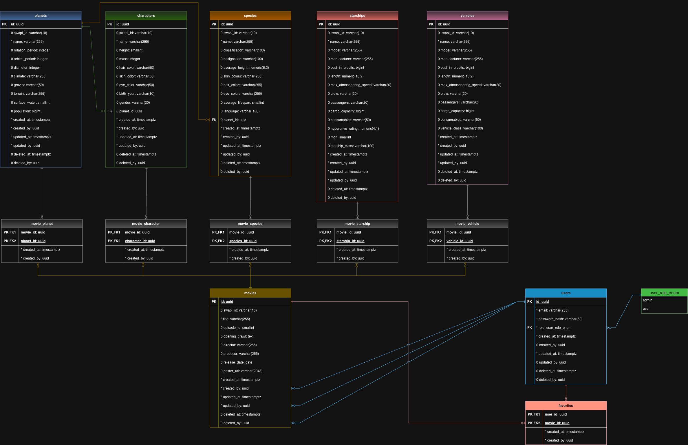

<p align="center">
  <a href="https://tomassalina.com" target="_blank" rel="noopener noreferrer">
    
  </a>
</p>

<h1 align="center">Conexa Movies Challenge</h1>

<p align="center">
  A Star Wars movie management backend built with NestJS for the Conexa Backend Engineer technical challenge.
</p>

<p align="center">
  Developed by <a href="https://tomassalina.com" target="_blank" rel="noopener noreferrer">Tomás Salina</a>
</p>

---

JWT-authenticated, role-based CRUD for movies, per-user favorites, and an
admin-only sync job that ingests the public
[Star Wars API (SWAPI)](https://swapi.info/) catalog (films, characters,
planets, species, starships and vehicles) into Postgres.

See [`CHALLENGE.md`](./CHALLENGE.md) for the original assignment brief (in
Spanish) and [`ARCHITECTURE.md`](./ARCHITECTURE.md) for the reasoning behind
the non-obvious design decisions.

## Table of Contents

- [Features](#features)
- [Extra Features](#extra-features)
- [Tech Stack](#tech-stack)
- [Getting Started](#getting-started)
- [API Documentation](#api-documentation)
- [Testing](#testing)
- [Folder Structure](#folder-structure)
- [Database Model](#database-model)
- [Deployment](#deployment)
- [Architecture Decisions](#architecture-decisions)

## Features

Requirements as specified in [`CHALLENGE.md`](./CHALLENGE.md):

- [x] **Authentication & authorization** — JWT-based signup and login
      (`POST /auth/signup`, `POST /auth/login`)
- [x] **User registration** — new users are persisted to Postgres with
      validation (password policy enforced via Zod, hashed with bcrypt)
- [x] **List movies** — `GET /movies`
- [x] **Movie details** — `GET /movies/:id`, restricted to authenticated
      users
- [x] **Create a movie** — `POST /movies`, admin only
- [x] **Update a movie** — `PATCH /movies/:id`, admin only
- [x] **Delete a movie** — `DELETE /movies/:id`, admin only
- [x] **SWAPI sync endpoint** — `POST /movies/sync`, admin only
- [x] **Unit tests** — endpoints, business logic, and access-control rules
- [x] **API documentation** — Swagger, with the docs URL below

## Extra Features

Beyond what the brief asked for:

- **Full SWAPI catalog sync** — not just movies: characters, planets,
  species, starships and vehicles are synced and persisted too
  (`src/characters`, `src/planets`, `src/species`, `src/starships`,
  `src/vehicles`), not only the films the brief required.
- **Read-only nested relation routes** — `GET /movies/:id/characters`,
  `/planets`, `/species`, `/starships`, `/vehicles` expose that synced catalog
  without giving it standalone CRUD (decision #4 in `ARCHITECTURE.md`).
- **Favorites** — `POST/DELETE/GET /favorites`, letting any authenticated
  user bookmark movies. Not requested in the brief at all.
- **Fail-closed permission system** — every route must explicitly declare
  `@Public()`, `@Permissions(...)`, or `@AnyAuthenticatedUser()`; a route with
  none of them throws `403` instead of silently becoming public
  (`PermissionsGuard`, decision #1).
- **Soft delete** — `DELETE /movies/:id` sets `deletedAt`/`deletedBy` instead
  of removing the row.
- **Sort-field whitelist** — `GET /movies?sortBy=...` is validated against a
  fixed enum and mapped through a second whitelist before ever reaching
  TypeORM's `order` clause, so no client-controlled string becomes a raw
  `ORDER BY` column (decision #8).
- **Swagger generated natively from Zod** — the same schemas used for
  request validation are converted to OpenAPI via Zod's own
  `z.toJSONSchema()`, so there is one source of truth and no separate,
  hand-maintained `@ApiProperty()` decorators (decision #3).
- **Manual sync endpoint *and* an automatic cron** — the brief asked for an
  endpoint *or* a cron; this ships both (`POST /movies/sync` plus a daily
  `@nestjs/schedule` job).

## Tech Stack

- **[NestJS](https://nestjs.com/) 12** (`@nestjs/common`, `core`,
  `platform-express`) — application framework
- **TypeScript 6**, ESM (`"type": "module"`)
- **PostgreSQL** + **TypeORM 1.1** (`@nestjs/typeorm`, `pg`) — persistence,
  with hand-written migrations (no `synchronize`)
- **[Zod 4](https://zod.dev/)** — request validation via NestJS's native
  Standard Schema pipe (`StandardSchemaValidationPipe`), no separate
  `class-validator` layer
- **JWT auth** — `@nestjs/jwt` + `bcrypt` for password hashing
- **`@nestjs/swagger`** — OpenAPI docs, generated directly from the same Zod
  schemas used for validation (see `src/common/openapi/zod-schema.util.ts`)
- **`@nestjs/schedule`** — daily cron job for the SWAPI sync
- **`@nestjs/axios`** — HTTP client used to call SWAPI
- **`helmet`** — baseline HTTP security headers
- **[Vitest 4](https://vitest.dev/)** (`@vitest/coverage-v8`) — unit and e2e
  tests
- **[oxlint](https://oxc.rs/docs/guide/usage/linter.html)** — linting
- **pnpm** — package manager

## Getting Started

### 1. Install dependencies

```bash
pnpm install
```

### 2. Configure environment variables

Copy `.env.example` to `.env` and fill in real values:

```bash
cp .env.example .env
```

| Variable | Description |
| --- | --- |
| `NODE_ENV` | `development` \| `production` \| `test` (defaults to `development`) |
| `PORT` | HTTP port the app listens on (defaults to `3000`) |
| `DATABASE_HOST` | Postgres host (e.g. `localhost`) |
| `DATABASE_PORT` | Postgres port (defaults to `5432`) |
| `DATABASE_USER` | Postgres user |
| `DATABASE_PASSWORD` | Postgres password |
| `DATABASE_NAME` | Postgres database name |
| `JWT_SECRET` | Secret used to sign/verify access tokens |
| `JWT_EXPIRES_IN` | Access token lifetime (e.g. `1d`) |
| `ADMIN_EMAIL` | Email for the first admin account, used by the seed script and by the sync cron to attribute scheduled writes |
| `ADMIN_PASSWORD` | Password for the first admin account, used by the seed script (must satisfy the same password policy as signup) |

All variables are validated on boot by `src/config/env.validation.ts`; the
app refuses to start if any required one is missing or malformed.

### 3. Start Postgres

A ready-to-use `docker-compose.yml` is included:

```bash
docker compose up -d
```

### 4. Run migrations

```bash
pnpm migration:run
```

### 5. Seed the first admin account

```bash
pnpm seed
```

This is idempotent — running it again when `ADMIN_EMAIL` already exists is a
no-op. See [How to get an admin account](#how-to-get-an-admin-account) below
for why this script is the *only* way to create one.

### 6. Start the app

```bash
pnpm start:dev
```

The app boots on `http://localhost:<PORT>` (default `3000`).

#### How to get an admin account

There is no HTTP endpoint that creates an admin:

- `POST /auth/signup` always creates the user with `Role.USER` — any
  client-supplied `role` field is silently discarded (the signup schema
  doesn't declare one).
- `PATCH /users/:id/role` (the only way to promote a user to admin) itself
  requires the `users:manage_role` permission, which only an existing admin
  holds.

This is intentionally a chicken-and-egg situation the seed script exists to
break: `pnpm seed` reads `ADMIN_EMAIL` / `ADMIN_PASSWORD` from the
environment and creates that one admin account directly, bypassing the
normal signup flow. Run it once after migrations; every admin after that is
created by an existing admin via `PATCH /users/:id/role`.

**Default seeded admin** (from `.env.example`'s values — this is a technical
challenge submission, not a production credential, so it's shared openly
here for anyone reviewing this repo to log in and try the admin-only
endpoints without running the seed script themselves):

```
email:    admin@conexa.ai
password: ChangeMe123!
```

## API Documentation

Once the app is running, Swagger UI is available at:

```
http://localhost:<PORT>/api/docs
```

The raw OpenAPI document is served as JSON at `/api/docs-json`.

Every route except `POST /auth/signup` and `POST /auth/login` requires a
bearer token. Obtain one by logging in:

```bash
curl -X POST http://localhost:3000/auth/login \
  -H 'Content-Type: application/json' \
  -d '{"email":"admin@conexa.ai","password":"ChangeMe123!"}'
```

Then pass the returned `accessToken` as `Authorization: Bearer <token>` on
subsequent requests (or via the "Authorize" button in Swagger UI).

| Resource | Endpoints | Access |
| --- | --- | --- |
| **Auth** (`/auth`) | `POST /signup`, `POST /login` | Public |
| | `GET /me` | Any authenticated user |
| **Users** (`/users`) | `PATCH /:id/role` | Admin only (`users:manage_role`) |
| **Movies** (`/movies`) | `GET /`, `GET /:id`, `GET /:id/characters`, `GET /:id/planets`, `GET /:id/species`, `GET /:id/starships`, `GET /:id/vehicles` | Any authenticated user |
| | `POST /`, `PATCH /:id`, `DELETE /:id` | Admin only (`movies:write`) |
| | `POST /movies/sync` | Admin only (`movies:sync`) — triggers a full SWAPI catalog sync |
| **Favorites** (`/favorites`) | `POST /:movieId`, `DELETE /:movieId`, `GET /` | Any authenticated user, scoped to their own favorites |

Characters, planets, species, starships and vehicles have no standalone
endpoints of their own — they're populated exclusively by the SWAPI sync and
exposed only as read-only nested routes under `/movies/:id/...` (see
[`ARCHITECTURE.md`](./ARCHITECTURE.md) for why).

The SWAPI sync also runs automatically once a day via a cron job
(`@nestjs/schedule`), attributed to the admin identified by `ADMIN_EMAIL`.

## Testing

```bash
pnpm test          # unit tests (vitest run, *.spec.ts)
pnpm test:cov      # unit tests with coverage
pnpm test:e2e      # end-to-end tests (*.e2e-spec.ts, separate vitest config)
pnpm test:watch    # unit tests in watch mode
```

Unit tests cover services, controllers, and the permissions guard across
the `auth`, `movies`, `favorites` and `swapi` modules, plus the SWAPI
response parsers. Both vitest configs (`vitest.config.ts` and
`vitest.config.e2e.ts`) exclude `**/.claude/**` from file discovery, so
agent worktrees created under `.claude/` don't get picked up as test files.

## Folder Structure

```
src/
├── main.ts              # Bootstrap: helmet, CORS, global Zod validation pipe, Swagger setup
├── app.module.ts         # Root module; registers the global JWT + permissions guards
├── auth/                 # Signup/login, JWT strategy, @Public/@Permissions/@AnyAuthenticatedUser decorators, role→permission mapping
├── users/                # User entity, role management (PATCH /users/:id/role)
├── movies/               # Movie entity + CRUD, pagination/sorting, nested relation routes, movie_* junction entities
├── favorites/            # Per-user favorites (entity + CRUD, scoped to the caller)
├── swapi/                # SWAPI HTTP client (HTTP/pagination only), sync service/controller/cron, per-resource Adapter classes (raw-to-DTO mapping), response DTOs and parsers
├── characters/           # Sync-only module: entity + service, no controller (see decision #4)
├── planets/              # Sync-only module: entity + service, no controller
├── species/              # Sync-only module: entity + service, no controller
├── starships/            # Sync-only module: entity + service, no controller
├── vehicles/             # Sync-only module: entity + service, no controller
├── common/               # Cross-cutting: Zod→OpenAPI bridge, response interceptors
├── config/               # Environment variable validation (env.validation.ts)
└── database/             # TypeORM data source, migrations, naming strategy, audit base entities, admin seed script
```

## Database Model



Source diagram: [`docs/db-schema.drawio`](docs/db-schema.drawio) — open it directly on
[app.diagrams.net](https://app.diagrams.net/) (File → Open From → Device) or view/edit
it inline via GitHub's built-in `.drawio` viewer.

`Movie`, `Character`, `Planet`, `Species`, `Starship` and `Vehicle` all also
carry a full audit trail (`createdBy` / `updatedBy` / `deletedBy` → `User`,
plus timestamps) and the five junction tables carry `createdBy`; these are
omitted above for readability — see `src/database/auditable.entity.ts`.
`swapiId` is nullable only on `Movie`, since it's the only entity with a
dual origin (SWAPI sync *or* manual admin authorship) — see decision #4 in
[`ARCHITECTURE.md`](./ARCHITECTURE.md).

## Deployment

**Live URL:** _TODO — fill in once the Dokploy deploy is live
(`http://89.116.170.218:3000/` is the Dokploy panel itself, not the app)._

Deploying via [Dokploy](https://dokploy.com/) on a self-hosted VPS
(Hostinger), connected to this GitHub repository for auto-deploy on push to
`main`. Connecting a repo to Dokploy requires one manual, one-time step in
its dashboard (Git → Create GitHub App → authorize via OAuth and select this
repo) — that authorization can't be done through the API alone, only the
project/application creation, env var configuration, and deploy triggers
can. Until the live URL above is filled in, run the app locally following
[Getting Started](#getting-started) above.

## Architecture Decisions

See [`ARCHITECTURE.md`](./ARCHITECTURE.md) for the reasoning behind the
non-obvious design decisions in this codebase (permission model, migrations
over `synchronize`, Zod-driven validation and docs, the `swapiId`
nullability split, favorites, admin bootstrap, the additive SWAPI sync, the
sort-field whitelist, and the SWAPI Adapter classes / HTTP-only
`SwapiService` split).
